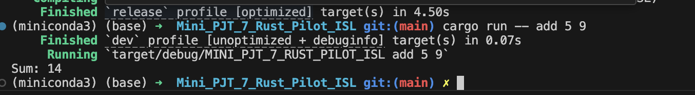
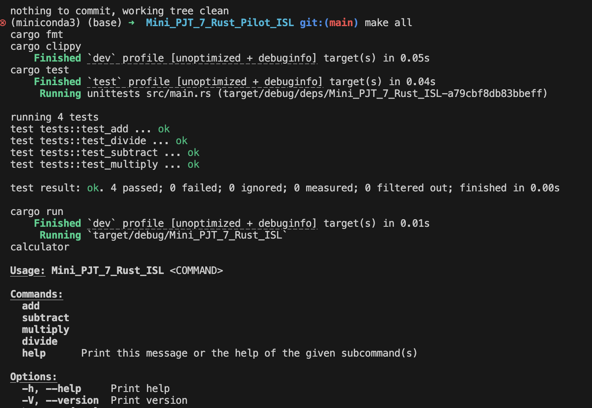
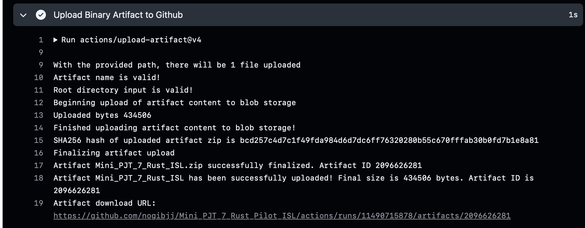

# IDS-706 Data Engineering Assignment
## Mini Project 8 : Package a Rust Script into a Command-Line Tool

#### Status(CI/CD) badge [](https://github.com/nogibjj/Mini_PJT_7_Rust_Pilot_ISL/actions/workflows/CICD.yaml)
------

### Proejct Purpose

- Creating a basic artimetric calculator as a command-line tool using the Rust programming language, and setting up CI/CD with GitHub

-----

### Requirements

* ***Package a Rust script with setuptools or a similar tool***
* ***Include a user guide on how to install and use the tool***

### Deliverables

* ***Package tool***
* ***Written Guide***
* ***Binary file as an artifact in CI/CD***

---------
### Project Structure
```
Mini_PJT_7_Rust_Pilot_ISL
├─ .devcontainer
│  ├─ Dockerfile
│  └─ devcontainer.json
├─ .github
│  └─ workflows
│     └─ CICD.yaml
├─ .gitignore
├─ Cargo.toml
├─ Makefile
├─ README.md
└─ src
   └─ main.rs               

```
- `Cargo.tolm` : Essential for configuring a Rust project. It defines project metadata such as name, version, dependencies, and edition.

- `main.rs` : The Rust source code that perfoms basic arithmetic operations (addition, subtraction, multiplication, division) using command-line argument parsing. It also includes unit tests to verify the correctness of each arithmetic function.
----------
###  ***Written Guide***
- [1] Rust installation (MacOS)  * Check the installed version with `rust --version` in command line 
   ```bash
   curl --proto '=https' --tlsv1.2 -sSf https://sh.rustup.rs | sh
   ```
- [2] `Clap` Dependency : Used to parse command-line argument. Ensure `Cargo.toml` file includes as following code
   ```bash
   [dependencies]
   clap = { version = "4.5.20", features = ["derive"] }
   ```
- [3] Compile the project : Compiles the project's source code, manages dependency and generates artifact
   ```bash
   cargo build
   ```

- [4] Run the code : Perform basic arithmetric operations using two numbers and a chosen operation.
   [operation] : `add`, `multiply`, `subtract`, `divide`
   [num1], [num2] : 연산할 숫자를 입력

   ```bash
   cargo run -- [operation] [num1] [num2]
   ```
   Test result : `cargo run -- add 5 9` -> Output : Sum: 14
   

- [5] Testing & Linting & Formatting : Run the following tools via the `Makefile`
   - format : `cargo fmt`, lint:	`cargo clippy`, test: `cargo test`, check: `cargo check` 

   


* ***Binary file as an artifact in CI/CD***
- Binary file is successfully released 




----------
### Reference
* https://github.com/noahgift/rust-new-project-template/blob/main/README.md
